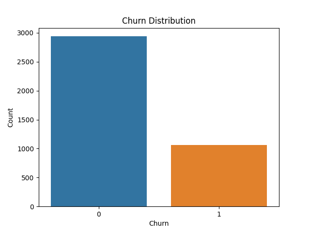
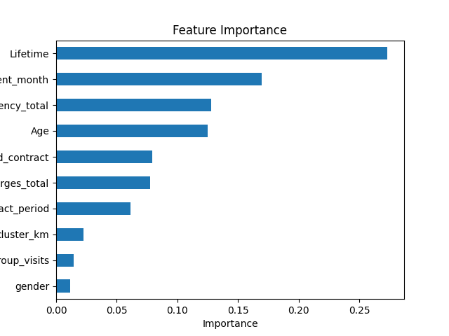
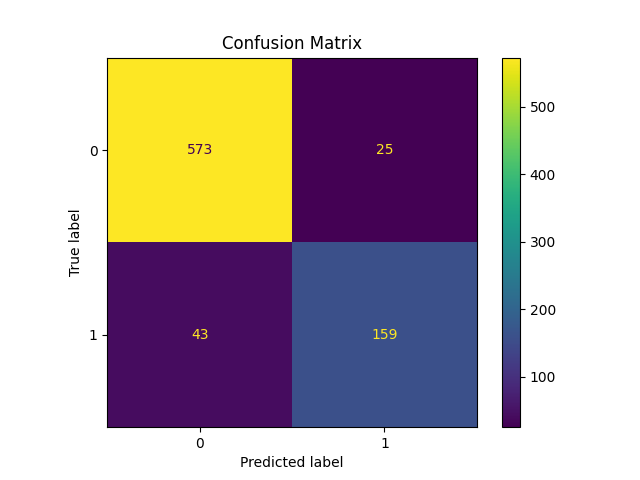

# 📊 Customer Churn Prediction (92% Accuracy)

Machine learning project to predict customer churn and identify high-risk segments, enabling data-driven retention strategies.

---

## 🚀 Business Problem

Customer churn represents a critical challenge for businesses, directly impacting revenue and growth.

The objective of this project was to identify customers at risk of leaving and uncover the key behavioral patterns driving churn.

---

## 🎯 Objective

- Predict customer churn using machine learning
- Identify high-risk customer segments
- Generate actionable insights to improve retention

---

## 🧠 Approach

1. Data Cleaning & Preprocessing  
   - Handled missing values  
   - Encoded categorical variables  
   - Normalized numerical features  

2. Exploratory Data Analysis (EDA)  
   - Analyzed churn distribution  
   - Identified correlations and trends  

3. Model Development  
   - Logistic Regression  
   - Random Forest  
   - Model comparison and tuning  

4. Model Evaluation  
   - Accuracy  
   - Precision / Recall  
   - Confusion Matrix  

---

## 📈 Key Insights

- Customers with low engagement levels showed a significantly higher probability of churn  
- Certain service usage patterns strongly correlate with retention  
- Tenure and interaction frequency are key predictors  

---

## 🏆 Results

- ✅ Achieved **92% accuracy** using Random Forest  
- ✅ Identified high-risk customer segments  
- ✅ Built a predictive model ready for business application  

---

## 💼 Business Impact

This model can help companies:

- Proactively target customers at risk  
- Optimize retention campaigns  
- Reduce revenue loss due to churn  

---

## 🛠 Tools & Technologies

- Python (Pandas, NumPy)
- Scikit-learn
- Data Visualization (Matplotlib / Seaborn)
- Jupyter Notebook

---

## 📷 Visualizations

### Churn Distribution


### Feature Importance


### Model Performance


---

## ▶️ How to Run

Clone the repository:

```bash
git clone https://github.com/your-username/customer-churn-prediction.git
```

Install dependencies:

```bash
pip install -r requirements.txt
```

Run the notebook:

```bash
jupyter notebook
```

---

## 📬 Contact

LinkedIn: https://linkedin.com/in/juan-carlos-vm/
GitHub: https://github.com/JuanCa85
